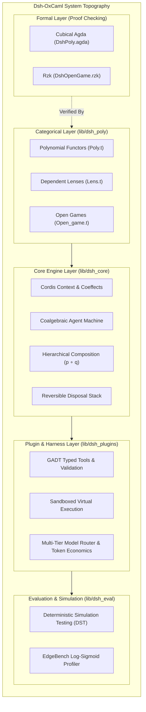

# Architecture Specification: Dsh-OxCaml

`Dsh-OxCaml` is an industrial-grade, type-safe agent harness ported from the DeepSeek Agent Harness (DSH) to native OxCaml and built on the Cordis Meta-Framework.

---

## 1. System Architecture



---

## 2. Directory Layout & Module Structure

```
Dsh-OxCaml/
├── bin/
│   ├── main.ml               # Dsh-OxCaml CLI executable
│   └── dune
├── lib/
│   ├── dsh_poly/             # Polynomial Functors & Categorical Cybernetics
│   │   ├── poly.mli / .ml    # Poly interfaces, monomials, dependent lenses
│   │   ├── open_game.mli/.ml # Open Games, Nash equilibria, co-state propagation
│   │   └── dune
│   ├── dsh_core/             # Coalgebraic Agent Engine & Cordis Runtime
│   │   ├── types.mli / .ml   # Strict ADTs for state, tokens, traces, errors
│   │   ├── context.mli / .ml # Dynamic coeffects & revertible disposal stack
│   │   ├── agent.mli / .ml   # Discrete-tick causal state machines
│   │   ├── hierarchy.mli/.ml # Hierarchical polynomial decomposition (p ∘ q)
│   │   └── dune
│   ├── dsh_plugins/          # DeepSeek Harness Native Plugins
│   │   ├── tool.mli / .ml    # GADT tool contracts & reversible mutations
│   │   ├── sandbox.mli / .ml # Isolated execution & memory virtual runtime
│   │   ├── model_router.mli/.ml # Model tiering (Frontier, Flash, Verifier)
│   │   └── dune
│   ├── dsh_eval/             # Deterministic Simulation & Benchmarking
│   │   ├── dst.mli / .ml     # Deterministic simulation testing & replay
│   │   ├── edgebench.mli/.ml # Log-sigmoid scaling law verification
│   │   └── dune
├── formal/
│   ├── agda/
│   │   └── DshPoly.agda      # Cubical Agda proof of Lawful Dependent Lenses
│   └── rzk/
│       └── DshOpenGame.rzk   # Rzk simplicial proof of 2-simplex causality
├── test/
│   ├── test_poly.ml          # Category theory & lens composition tests
│   ├── test_agent.ml         # Agent execution & error rollback tests
│   ├── test_sandbox.ml       # Sandboxing & tool execution tests
│   ├── test_dst.ml           # Deterministic time-travel & replay tests
│   └── dune
├── examples/
│   ├── coder_agent.ml        # Autonomous self-repairing coding agent
│   ├── multi_agent_team.ml   # Architect -> Coder -> Tester team topology
│   └── dune
├── build.bat
├── RUN.bat
├── dune-project
├── dsh-oxcaml.opam
├── README.md
├── ARCH_SPEC.md
└── THEORY.md
```

---

## 3. Core Technical Invariants

1. **Zero-Allocation Dependent Lenses:** Forward positions and backward directions are strongly typed via OCaml 5 records with unboxed memory representations.
2. **Revertible Temporal Effects:** Side-effects (filesystem modifications, spawned processes, network connections) register cleanups into the Cordis disposal stack. Teardowns execute in exact inverse causal order.
3. **Deterministic Simulation Invariant:** The DST harness guarantees that identical random seeds and virtual tick sequences produce identical execution traces bit-for-bit across platforms.
4. **Hierarchical Complexity Invariant:** Factorization through $p \circ q$ ensures context windows remain bounded ($O(1)$ per local turn), avoiding the $O(N^2)$ quadratic token explosion of naive chat loops.
